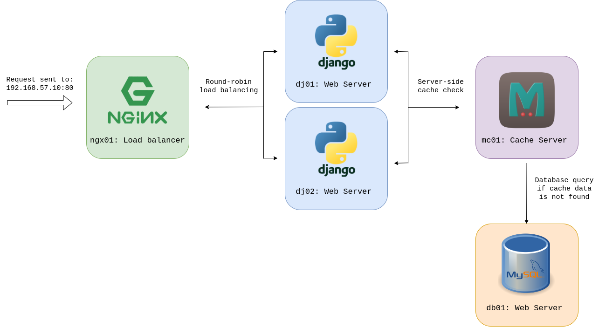

# Quotecraft Docker Provisioning

This project extends the previous repository Quotecraft. They share the same functions and architectural design. Please visit the [link](https://github.com/cojuny/quotecraft) for more details.


Unlike the previous repository, the applications are carried in docker containers instead of virtual machines. The choice has brought several benefits:

1. **Startup time:**
   The major benefit of a container is that it does not involve an operating system. They typically start in seconds, making them suitable for dynamic scaling and orchestration.
2. **Resource usage:**
   Since they don't require a full operating system, containers have less overhead in terms of memory and storage. Instead, they share the host OS kernel and use fewer resources, allowing for efficient utilization of system resources.
3. **Dependency Management:**
   The containers are managed in Docker Compose, which handles dependencies between services, allowing containers to start services without conflicts.  
 
 

## Architecture Overview



The architecture consists of the following components:

- **ngx01**: Nginx Load Balancer
  - Balances incoming traffic between two Django web servers.
- **dj01** and **dj02**: Django Servers
  - Serve the Quotecraft web application, handle user requests, and communicate with the cache server and the database.
- **mc01**: Memcached Server
  - Sits in front of the database, and caches recently accessed data to improve performance.
- **db01**: MariaDB MySQL Database
  - Stores quote data and interacts with Django servers.


## Docker Compose Auto Provisioning:
To run the repository, please follow the steps below: 

1. **Cloning the Repository:**
   ```sh
   git clone https://github.com/cojuny/quotecraft.git
2. **Install Docker Engine and Docker Compose plugin:**

   https://docs.docker.com/engine/install/

   
   https://docs.docker.com/compose/install/linux/

3. **Run Compose.yaml:**
  ```sh
   sudo docker compose up --build
